# Flow Git e Github na prática
sejam bem vindos a mais um flow de aprendizado, eu sou a Rafael Rampasso e hoje eu vou mostrar pra vocês como utilizar o GIT na prática

## Instalando o GIT

* [Link com os downloads](https://git-scm.com/downloads)

## Criar um projeto novo

* Criar uma nova pasta em seu computador, com o nome `Flow Git`

* Abrir o VSCode nessa pasta

* Criar um novo arquivo `README.md`

* Escrever dentro dele `Você aprenderá alguns comandos do Git`

* Salva o arquivo

Agora então é hora de usarmos o Git

* Abre o Git Bash que foi instalado na máquina (pode ser pelo terminal do VSCode mesmo)

* `git init` para inicializar o repositório

Foi criada uma pasta `.git` e é ali que toda a mágica acontece, então não apague

* `git add README.md` para colocar o arquivo na área de stagging 
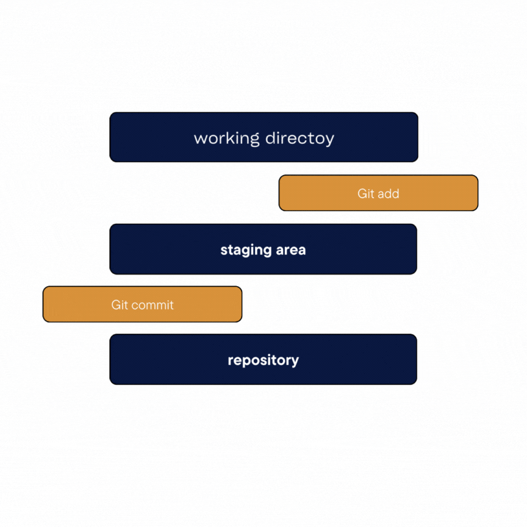

Esse `add` é necessário antes de darmos o commit.

* `git commit -m "primeiro commit"` dar o commit no repositório.

* `git branch -M "main"` para alterar o nome da branch principal de `master` para `main` (isso é uma boa prática atualmente recomendada)

## Interfaces Git

Beleza, recebemos a confirmação de que o commit aconteceu, mas isso tá um pouco abstrato ainda né?
Existem algumas [interfaces legais do git](https://git-scm.com/downloads/guis) que você pode fazer o download para poder visualizar como está o projeto, o que foi alterado em cada commit, quando foi alterado etc.
Aqui eu vou mostrar pra vocês a usarem direto no Github.

## Repositório no Github

* Depois de você ter criado a sua conta na plataforma, você irá em `Criar novo repositório`

Você vai preencher com as informações do projeto, então dar o nome do repositório, colocar uma breve descrição e criar

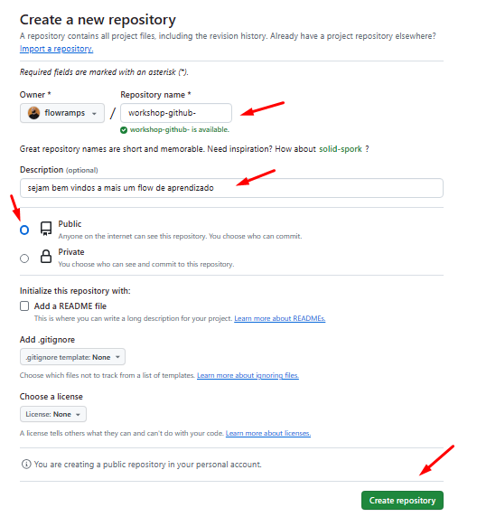

Logo depois vai aparecer essa página um pouco cinza e confusa e com vários comandos (pode até perceber que alguns deles já usamos), mas o que você tem que fazer é bem simples, apenas copie o link que aparecer para você

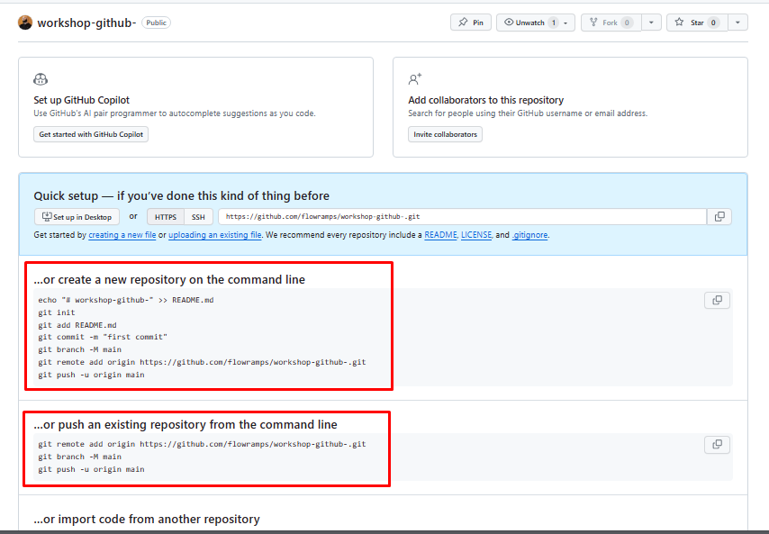

* Para passar o commit do meu repositório local (da minha máquina) para um repositório na plataforma do Github, usamos o `git remote add origin <link do repositório>`

* `origin` é o nome utilizado para referenciar o nosso repositório

Agora já temos o nosso repositório local conectado com o respositório do Github, porém o `commit` que damos na máquina não sobe automaticamente para a plataforma

* Para isso precisaremos empurrar, enviar para lá com o `git push -u origin main`

Agora se recarregarmos a página iremos ver o nosso arquivo aqui na plataforma!

## Alterando e adicionando arquivo

Beleza, agora que temos o nosso repositório no Github configurado direitinho, podemos usar e abusar do que o Git oferece, afinal é pra isso que estamos utilizando ele né?
Primeira coisa que faremos então é alterar esse arquivo que já commitamos

* Adiciona mais uma frase no arquivo `Essa é uma alteração`

* Além disso iremos criar um novo arquivo `Projeto.md`, onde escreveremos `Esse é o arquivo onde desenvolverei o meu projeto`

* Agora então precisamos subir essa alteração, pra isso seguiremos os mesmos passos de `git add .` (agora ponto `.` pois adiciona todos os arquivos) e `git commit -m "Primeira alteração"`

* Lembrando que para alterar algo no nosso respositório do Github precisamos dar o push, então `git push origin main` (sem o -u)

Se olharmos agora o nosso código no Github, ele terá sido alterado, e não só isso, se clicarmos no nome do `commit`, podemos ver exatamente as alterações que foram feitas nele.

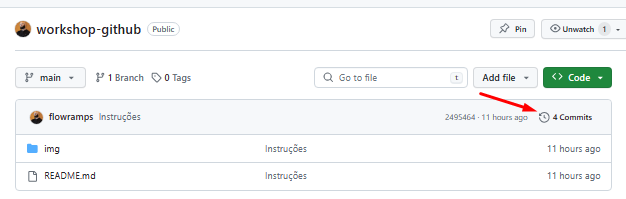

Aqui nesse botão poderemos ver todos os commits já feitos anteriormente, então se clicarmos em algum deles, veremos exatamente o que havia sido alterado, além de claro, vermos o código como era. Incrível né?

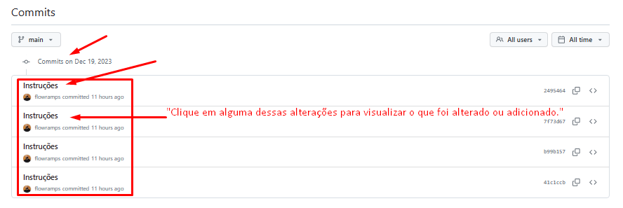

O verde com `+` e o vermelho com `-` mostra, os conteúdos que foram adicionados e editados dentro do código.
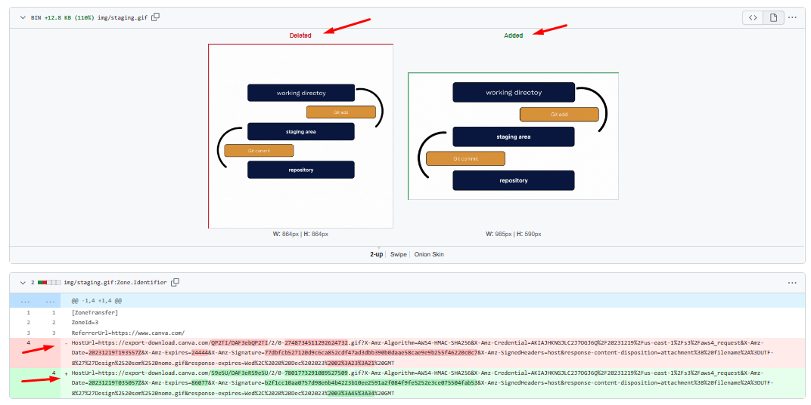

## Branch

Até agora tudo o que fizemos de alterações e mandamos de commit, foi na nossa `main`, que é aquela linha do tempo principal.
Agora vou mostrar pra vocês como criamos uma branch e depois como que juntamos ela com o código que já está na `main` (lembrando que ela é uma linha cronológica adicional/alternativa a principal)
E outra, a branch pode ser criada tanto para quando você for fazer uma alteração em um arquivo, quando para adicionar outro arquivo dentro do projeto ou mesmo excluir.
<br>
Obs. *Lembrem que eu estou aqui editando um arquivo markdown, porém isso tudo vale para qualquer tipo de arquivo com qualquer extensão*

* Nesse caso vamos adicionar um novo arquivo para desenvolver a nossa feature `Flow-Git`

* Então a primeira coisa que fazemos é `git checkout -b "dev"`, assim criando uma branch para ele
Esse comando além de criar a branch já entra nela com o checkout, inclusive se olharmos agora aqui no meu VSCode, estamos dentro dela.
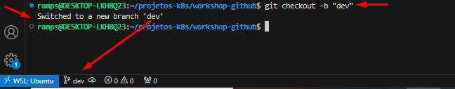

* Vou então criar o arquivo, criar o `flow-git.md` "aqui eu crio o arquivo"


* E agora fazemos o passo a passo que já sabemos, colocamos a nossa alteração em stagging com o `git add .` e commitamos com o `git commit -m "novo arquivo"`

* Para enviarmos agora que vai ser diferente. Vocês lembram que utilizávamos o `git push orgin main` né? Porém main era aquela branch principal. Agora então usaremos `git push origin dev`

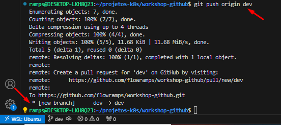

Agora se olharmos o nosso Github, veremos que tem 2 branches, a `main` e a `dev`

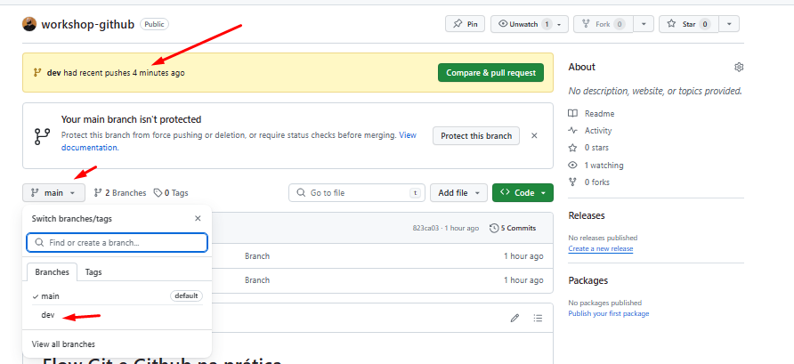

Vamos supor que eu ainda não tivesse terminado de desenvolver, eu poderia continuar tranquilamente na branch `dev` até terminar!

Mas Ramps, e se eu precisasse por algum motivo voltar naquela branch `main` e desenvolver a partir do que deixei lá? Sem problemas, a única coisa que você precisa fazer nesse caso é `git checkout main`, e pra voltar depois é só `git checkout dev` novamente

Beleza! Agora desenvolvi tudo o que queria aqui na branch `dev`, como que junto ela com a main sem conflitos? É através do merge, vejamos abaixo!

## Merge

* Agora o que precisamos fazer é ir para a nossa branch principal `git checkout main` e lá faremos o merge com a branch `dev` que criamos, com `git merge dev`

Pronto, agora tudo o que tinha de alteração na branch `dev` juntou com a `main`

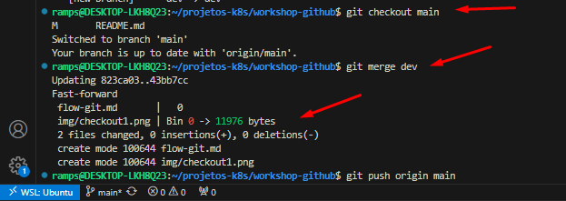

* Para finalizar então, vamos jogar lá no Github isso tudo com o `git push origin main`

## Clone

Como vocês podem baixar meu código?

Sempre que você entrar em um repositório, seja o seu ou o de qualquer outra pessoa, terá esse botão `Code`, que quando você clica aparece um link:

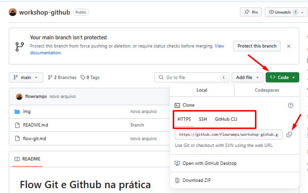

* Você irá copiar esse link e levar ele lá pro nosso terminal

* O comando para puxar o projeto para a sua máquina é o `git clone https://github.com/flowramps/workshop-github.git`

Não é necessário criar um repositório antes disso, como fizemos anteriormente com o `git init`. Dessa vez, basta abrir o terminal e clonar o projeto e tudo aparecerá!

## Pull

E se eu fizer uma alteração no repositório, como vocês podem atualizar na máquina de vocês?

* Basta vocês executarem o comando `git pull`, ele irá puxar todas as alterações feitas no repositório do Github para o seu repositório local

## Fork

Mas Ramps quando eu fiz o clone do seu repositório ele não apareceu no meu Github.
Existe a ferramenta `fork`, que é bem mais simples para fazer isso
Você só precisa apertar nesse botão dentro do repositório e sucesso jovem! Ele aparece automaticamente lá na sua conta:

Clica e faça o teste pra você ver como vai ficar!

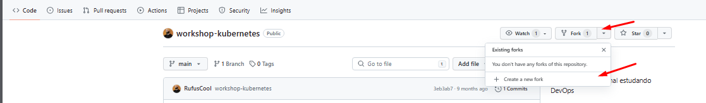

## Pull request

O último conceito que quero ensinar para vocês é o de Pull Request ou como falamos de `PR`, vamos entender como ele funciona:

* Após você ter dado um fork no projeto e ele ter ido pra sua conta, você poderá alterar o projeto e adicionar as funcionalidades que deseja

* Você pode por exemplo dar um fork no meu repositório de `workshop-github` e ir melhorando o conteudo do seu `README.md` ou adicionar mais conteúdos que possam ajudar a comunide em seu desenvolvimento por exemplo nessa página. 

* Depois disso, você poderá salvar o projeto, dar o `git add .`, `git commit -m "trecho PR"` e `git push origin main` como vimos nos passos anteriores.

Quando você for olhar o seu Github, verá que existe uma mensagem parecida com a seguinte:
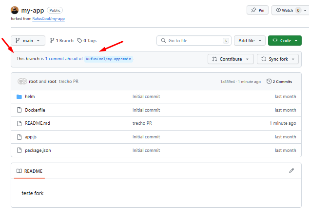

Isso significa que a branch do seu repositório está 1 commit "na frente" da branch original

O que você deve perceber agora é esse botão que aparece em seguida:

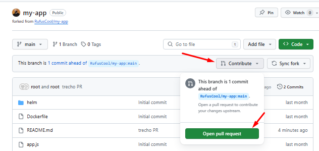

Ele servirá para caso você deseje enviar para o dono do repositório original uma solicitação de pull, ou seja, fazer com que ele puxe as alterações que você fez no seu repositório para o repositório dele, original

Ao clicar nesse botão, você será direcionado para uma página que fará a avaliação se esse `pull request` terá conflitos ou não com o código no repositório original. Caso não tenha, bastão clicar no botão de `Create pull request`

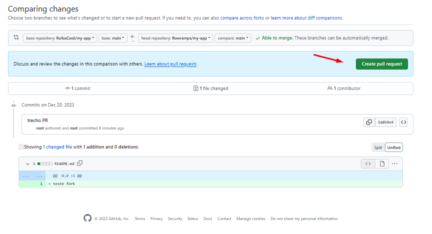

Você irá colocar um nome intuitivo, que demonstre a funcionalidade adicionada e o ideal é que você também crie uma boa descrição do que desenvolveu, não somente explicando o que é, mas ensinando ao dono do repositório original a forma como ele poderá testar também

Depois disso, basta esperar para que o dono da branch original aceite o seu pull request

## Finalização

Existem diversas outras funcionalidades do Git e do Github, porém tenho certeza que com tudo isso que vocês viram hoje vocês já conseguem desenvolver um projeto de uma forma bem legal

Recomendo sempre vocês darem uma olhada na [documentação do Git](https://git-scm.com/doc), pois qualquer dúvida que apareça pode ser respondida por lá na explicação

**Não esqueçam de deixar o like e se inscrever no [canal do Youtube](https://www.youtube.com/@EstudandoDevops) **

E aproveitando já aperta o Star para fortalecer o repo!


Até a próxima...

## Clone

## Configurações Globais

# Configurar o editor padrão e a branch inicial
```
git config --global core.editor vim
git config --global init.defaultBranch main
```
# Visualizar as configurações globais
```
cat ~/.gitconfig
```
# Configurar o editor do sistema para uso global com o Vim
```
git config --system core.editor vim
```
## Inicialização de Repositório

# Inicializar um repositório Git
```
git init
```
## Gerenciamento de Arquivos

# Adicionar um arquivo para ser rastreado
```
git add arquivo.txt
```
# Desfazer a adição de um arquivo
```
git reset
```
# Efetuar um commit
```
git commit
```
## Gerenciamento de Commits

# Adicionar e commitar alterações de forma rápida
```
git commit -a -m "Commit rápido para arquivo.txt"
```
# Visualizar o histórico de commits
```
git log
```
# Visualizar o histórico de um arquivo específico
```
git log -p arquivo.txt
```
# Reverter para um commit específico
```
git checkout 2cc62bbe0f7fcfb4483df968fb169dc85e01cfa4
```
# Reverter para a branch principal
```
git checkout main
```
# Desfazer o último commit sem perder alterações
```
git reset --soft HEAD~1
```
# Desfazer o último commit e descartar alterações
```
git reset --hard
```
## Ignorando Arquivos

# Utilize o arquivo .gitignore para especificar quais arquivos não devem ser incluídos no repositório.

## Gerenciamento de Branches

# Criar uma nova branch
```
git branch feature/novo_arquivo
```
# Mudar para uma branch específica
```
git checkout feature/novo_arquivo
```
# Mudar o nome da branch atual
```
git branch -m novo_nome
```
# Deletar uma branch
```
git branch -D nome_da_branch
```
## Merge

# Criar uma nova branch e efetuar o merge
```
git checkout -b stg
git checkout main
git merge stg
```
# Deletar uma branch após o merge
```
git branch -d stg
```
## Rebase

# Atenção: O uso de rebase pode reescrever o histórico, use com cuidado.
```
git rebase stg
```
## Cherry Pick

# Selecionar commits específicos de uma branch e aplicá-los em outra
```
git log
git cherry-pick 5801dac2c67519a4041666421149877c39439a20
```
## Git Tag

# Listar todas as tags
```
git tag
```
# Criar uma tag
```
git tag -a v2.0 -m "Versão 2.0"
```
# Adicionar uma tag a um commit específico
```
git tag -a v1.0 -m "Versão 1.0" 5801dac2c67519a4041666421149877c39439a20
```
# Visualizar detalhes de uma tag
```
git show v2.0
```
# Deletar uma tag
```
git tag -d v2.0
```
## Trabalhando com repositório remoto

# Criar e commitar em uma nova branch
```
git checkout -b branchnova
git add .
git commit -m "Aletração em arquivo main.txt (teste remoto)"
```
# Realizar o merge na branch principal e fazer o push
```
git branch main
git checkout main
git merge branchnova
git push
```
## Lidando com conflito

# Realizar fetch e validar/listar branches existentes
```
git fetch origin
git branch -r
```
# Realizar checkout na branch remota e validar diferenças
```
git checkout origin/main
git diff main origin/main
```
# Realizar merge após ajustes e commit
```
git checkout main
git merge origin main
git commit -a -m "Merge commit fetch"
git push
```
## Git Log

# Diversas opções de visualização do histórico
```
git log --oneline
git log
git log --stat
git log --n
git log --graph --oneline
git log --author="msrampasso"
git log --after="1 week ago"
```
## Publicação

# Adicionar, commitar e fazer push para a branch master
```
git add .
git commit -m "Script para validação cn - azure e ops"
git push origin master
```
Espero que este guia seja útil para entender e utilizar o Git de forma eficiente. Sinta-se à vontade para personalizar conforme necessário.

